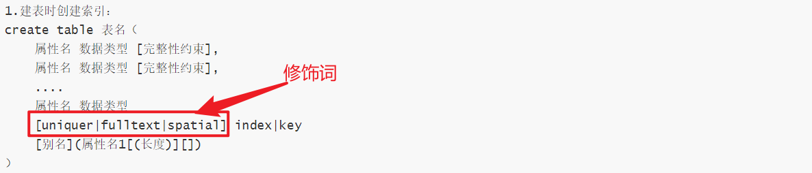

**创建表：**

```
	create	table	表名（
属性名	数据类型	[完整性约束条件]，	
属性名	数据类型	[完整性约束条件]，
.
.
属性名	数据类型	[完整性约束条件]
）;
```

**约束条件：**

```
primary	key:标识该属性为该表的主键，可以唯一的标识对应的记录
foreign	key:标识该属性为该表的外键，与某表的主键关联
not	null   :标识该属性不能为空
unique	   :标识该属性的值是唯一的
auto_increment:标识该属性的值自动增加
default	   :为该属性设置默认值
```

**查看表结构：**

```
1.查看基本表结构：desc 表名；
2.查看表详细结构：show	create	table	表名；	
```

**修改表：** 

```
1.修改表名：alter	table	旧表名	renmae	新表名
2.修改字段：alter	table	change	旧属性名	新属性名	新数据类型
3.增加字段：alter	table	add	 属性名1	数据类型	[完整性约束条件][first|after 属性名2]
4.删除字段:alter	table	表名	drop	属性名
```

**删除表：**

```
1.删除表：drop	table 表名；
```

**单表查询：**

```
1.查询所有字段:
	select 字段1,字段2...from 表名；
	select	*	from  表名； 
2.查询指定字段：
	select	字段1,字段2...from	表名；
3.where	条件查询
	select	字段1,字段2...from	表名	where	查询条件；
4.带in关键字查询：
	select	字段1,字段2...from	表名	where	字段 [not]in (元素1，元素2,元素3)；
5.带between	and 的范围查询
	select	字段1，字段2...	from	表名	where  字段  [not]between	取值1	and	取值2；
6.带like的模糊查询：
	select	字段1，字段2...from	表名	where	字段	[not]	like"字符串";
"%":代表任意字符
"_":代表单个字符
7.空值查询：
	select	字段1，字段2...from	表名 where	字段	is	[not]	null;
8.带 and	的多条件查询语句：
	select	字段1，字段2...from	表名	where	条件表达式1 and	条件表达式2[..条件表达式n];
9.带or的多条件查询：
	select	字段1，字段2...from	表名	where	条件表达式1	or 条件表达式2 [条件表达式n];
10.去重查询：
	select	distinct 字段名	from  表名；
11.对查询结果排序：
	select	字段1，字段2...from  表名  order by 属性名 [asc|desc];
(默认情况下是自增asc);
12.group by分组查询：
	group by 属性名 [having 条件表达式][with rollup]
(1.单独使用
 2.与group_concat()函数一起使用
 3.与聚合函数一起使用
 4.与having一起使用（限制输出的结果）
 5.与with rollup一起使用(最后加入一个总和行)
	)
13.LIMIT分页查询：
	select 字段1，字段2...from  表名  limit  初始位置,记录数；
```

**使用聚合函数查询:**

```
1.count()函数：
	{1.count()函数用来统计记录的条数
	 2.与group by关键字一起 使用
	}
2.sun()函数:
	{1.sun()函数是求和函数
	 2.与group by关键字一起使用
	}
3.AVG()函数:
	{1.AVG()函数是求平均值的函数；
	 2.与group by关键字一起使用
	}
4.MAX()函数：
	{1.MAX()函数是起最大值的函数
	 2.与group by关键字一起使用
	}
5.min()函数：
	{1.min()函数是求最小值的函数
 	2.与group by关键字一起使用
	}
```

**连接查询：**
连接查询是将两个或者两个以上的表按照某个条件连接起来，从中选取需要的数据

```
1.内连接查询
	内连接查询是一种最常用的连接查询，内连接查询可以查询两个或者两个以上的表
2.外连接查询
	外连接查询可以查某一张表的所有信息
	select 属性名列表 from  表名1  left|right join  表名2  on  表1.属性1=表2.属性2；
2.1左连接查询
	可以查询处表名1的所有记录，而表名2中只能查询匹配的记录(如果没有的话就会用null代替)
2.2右连接查询
	可以查询出表2的所有的记录，而表1中只能查询处匹配记录(如果没有的话就会用null代替)
3.多条件查询
```

**子查询：**

```
1.带in关键字子查询：
	一个查询语句的条件可能落在另一个select语句的结果中
2.待比较元算符的子查询
	子查询可以使用比较元算符
3.带exists(存在)关键字的子查询
	假如子查询查询到记录，则进行外层查询，否则，不执行外层查询
4.带any关键字的子查询
	any关键字表示满足其中任意条件
[eg:select * from 表1 where price>= any (select price  from 表2; )]
5.带all关键字的子查询
	all关键字表示满足所有条件
```

**合并查询结果：**

```
1.union
	使用union关键字，数据库系统会将所有的查询结果合并到一起，然后取出相同的记录
2.union	all
	使用union all 不会去掉重复的记录
```

**为表和字段去别名：**

```
1.为表取别名
	格式：表名   表的别名
2.为字段取别名
	格式：属性名 [as] 别名
```

**插入数据：**

```
1.给表的所有字段插入数据
格式：insert into 表名 values(V1,V2...);
2.给表的指定字段插入数据
格式：insert into 表名(字段1，字段2...) values(V1,V2...);
3.同时插入多条数据
格式：insert into 表名[(字段列表)] values(第一组值),(第二组值)...(第n组值);
4.更新数据
	update 表名  set  属性名1=取值1，属性名2=取值2....属性名n=取值n	where	条件表达式
```

**删除数据：**

```
1.删除数据
	delete from 表名 [where 条件表达式]
```

**索引：**

```
1.索引引入：
	索引定义：索引是由数据库表汇总一列或者多列组合而成，其作用是提高对表中数据的查询速度；类似于图书的目录，方便快速定位，寻找指定内容。
2.索引的优缺点：
	优点：提高查询数据的速度
	缺点：创建和维护索引的时间增加了
3.索引实例：
4.索引分类：
	1)普通索引：
这类索引可以创建在任何数据类型中
	2)唯一性索引：
使用unique参数可以设置，在创建唯一性索引时，限制该索引的值必须是唯一的
	3)全文索引：
使用fultext参数可以设置，全文索引只能创建在char,varchar,text类型的字段上。主要作用就是提高查询较大字段字符串类型的速度，只有myisam引擎支持该索引，MySQL默认情况下不支持、
	4)单列索引：
在表中可以给单个字段创建索引，单列索引可以是普通索引，也可以是唯一性索引，还可以是全文索引
	5)多列索引：
多列索引是在表的多个字段上创建一个索引。
	6)空间索引：
使用spatial参数可以设置空间索引，空间索引只能建立在空间数据类型上，这样可以提高系统获取空间数据的效率；
```

**创建索引：**

```
1.建表时创建索引：
create table 表名（
	属性名 数据类型 [完整性约束],
	属性名 数据类型 [完整性约束],
	....
	属性名 数据类型
	[uniquer|fulltext|spatial] index|key
	[别名](属性名1[(长度)][])
）
2.创建普通索引：
3.创建唯一索引：
4.创建全文索引：
5.创建单列索引：
6.创建多列索引：
	create table 表名(
属性名 数据类型 [完整性约束],
属性名 数据类型 [完整性约束]
...
属性名 数据类型 
index [索引别名] (属性名1，属性名2...)

)
7.创建空间索引：
8.在已经存在的表上创建索引：
	create [unique|fulltext|spatial] index 索引名 on 表名 (属性名[(长度)][ASC|DESC],属性名2...)
9.用alter table语句来创建索引：
	alter table 表名 add[unique|fulltext|spatial] index 索引名 (属性名[(长度)][ASC|DESC]);
10.删除索引：
drop index 索引名 on 表名；
```



**视图：**

```
1.视图的引入：
	1)视图是一种虚拟的表，是从数据库中一个或者多个表中导出来的表。
	2)数据库中存放了视图的定义，而并没有存放视图中的数据，这些数据存放在原来的表中
	3)使用视图查询数据时，数据库系统会从原来的表中取出对应的数据。
2.视图的作用：
	1)使操作简便化
	2)增加数据的安全性
	3)提高表的逻辑独立性
3.创建视图：
create [algorithm={undefiend|merge|temptable}] view 视图名 [(属性列表)] as select 语句 [with[cascaded|local]check option];
algorithm是可选参数，表示视图选择的算法；
“试图名”参数表示要创建的视图的名称
“属性列表”是可选参数，其指定了视图中各种属性的名词，默认情况下与select语句中查询的属性相同；
select语句参数是一个完整的查询语句，标识从某个表中查出某些满足条件的记录，将这些记录导入视图中；
with check option是可选参数，表似乎更新视图时要保证在该视图的权限范围之内；
algorithm包括3个选项undefined、merge和temptable。其中undefined选项表示mysql将自动选择所要使用的算法，merge选项表示将使用视图的语句与视图定义合并起来，使得视图定义的某一部分取代语句的对应部分;temptable选项表示将视图的结果存入临时表，然后使用临时表执行语句；cascaded是可选参数，表示更新视图时需要满足所有相关食欲和表的条件，该参数为默认值；local表示更新视图时，要满足视图本身的定义条件即可。
```

**创建视图：**

```
1.在单表上创建视图
	create view 视图名称 as select * from 表名;
	CREATE VIEW v3(c,a)【两个字段设置名称】  as SELECT CODE,ANSWER FROM t0715;
2.在多表上创建视图
	create view v5 as select a1.CODE,a2.NAME FROM 表1 a1,表2 a2 where 条件语句;
```

**查看视图：**

```
1.describe 视图名称; 语句查看视图基本信息
2.show table status [like '%..%']； 语句查看视图基本信息
3.show create view 视图名称； 语句查看视图详情信息
4.在views表中查看视图详情信息
```

**修改视图：**

```
1.create or replace view 语句修改视图；
	create or replace [algorithm={undefined|merge|temptable}] view 视图名 [(属性列表)] as select 语句 [with[cascaded|local] check option];
	
eg:CREATE or REPLACE view v1(a,b) as SELECT  CODE,QUESTION from t0715 ;
2.alter 语句修改视图：
	alter [algorithm={undefined|merge|temptabl}] view 视图名 [(属性列表)] as select 语句 [with[cascaded|local] check option]; 
	
eg:alter view v1 as SELECT * from t0715;
```

**更新视图：**

```
更新视图是指通过视图来插入(insert)、更新(update)和删除(delete)表中的数据，因为视图是一个虚拟的表，其中没有数据。通过视图更新，都是转换基本表来更新，更新视图时明智更新权限范围内的数据,超出范围就不能更新。
```

**插入(insert)：**

```
insert into 视图名称 VALUES(值,值...);
```

**更新(update):**

```
update 视图名称 set 属性名="值",属性名="值"...[where 条件语句];
```

**删除(delete)：**

```
delete from 视图名称 [where 条件语句];
```

**删除视图：**

```
删除视图时值删除数据库中已存在的视图，删除视图时，只能删除视图的正文，不会删除数据，
drop view [if exists] 视图名列表 [restrict|cascade]
```

**触发器：**

```
1.触发器的引入：
触发器(trigger)是由事件来触发某个操作，这些时间包括insert 语句、update语句和delete语句，当数据库系统执行这些事件时，就会激活触发器执行相应的操作。
```

**创建和使用触发器：**

```
1.创建只有一个执行语句的触发器：
	create  trigger 触发器名称 before|after 触发事件 on 表名 form each row 执行语句；
2.创建有多个执行语句的触发器：
delimiter |
	create trigger 触发器名称 before|after 触发事件 on 表名 for each row begin 执行语句列表 end 
| delimiter
```

**查看触发器：**

```
1.show triggers 语句查看触发器信息
2.在trigger 表中查看触发器信息
```

**删除触发器:**

```
drop trigger 触发器名称；
```

**MYSQL常用函数：**

```
1.日期和时间函数
	1)curdate()返回当前日期
	2)curtime()返回当前时间
	3)month(d) 返回日期d中的月份值
2.字符串函数
	1)char_length(s)计算字符串s的字符数
	2)upper(s)      那所有字母变成大写字母
	3)lower(s)		把所有字母变成小写字母
3.数字函数
	1)abs(x) 求绝对值
	2)sqrt(x) 求平方根
	3)mod(x,y) 求余
4.加密函数
	1)password(str) 一般对用户的密码加密		不可逆
	2)md5(str)普通加密  不可逆
	3)encode(str,解密钥匙)加密函数，结果是一个二进制数，必须使用blob类型的字段来保护它
	4)decode(密文,解密钥匙)解密函数
```

**存储过程和函数：**

```
1.存储过程和函数的引入
	存储过程和函数试下数据库中定义一些SQL语句的集合，然后直接调用这些存储过程和函数执行已经定义好的SQL语句，存储过程和函数可以避免开发人员重复的编写相同的SQL语句，存储过程和函数是在mysql服务器中存储和执行的，可以减少客户端和服务器端的数据传输；
```

**创建存储过程和函数：**

```
1.创建存储过程
	create  procedure  sp_name([proc_parameter[...]]) [characteristic...] routine_body
sp_name 参数是存储过程名称
proc_parameter 表示存储过程的参数列表
characteristic 参数指定存储过程的特性
routine_body  参数是SQL代码的内容，可以用begin..end来标志SQL代码的开始和结束
proc_parameter中的每个参数由3部分组成，这3部分分别是输入输出类型，参数名称和参数类型
[In|OUT|INOUT]param_name type
其中IN表示输入参数，OUT表示输出参数，INOUT表示既可以是输入也可以是输出，param_name参数是存储过程的参数名称；type参数指定存储过程的参数类型，该类型可以是mysql数据库的任意数据类型；Characteristic参数有多个取值，取值说明如下：
language sql:说明routine_body部分是由SQL语言的语句组成，这也是数据库系统默认的语言。
deterministic:指明存储过程的执行结果是否是确定的，deterministic表示结果是正确的。每次执行存储过程时，相同的输入会得到相同的输出。
not deterministic表示结果是非确定的，相同的输入可能得到不同的输出，默认情况下，结果是非确定的。
{contains sql|not sql |reads sql data |modifies sql data}:指明子程序使用SQL语句的限制；contains sql表示子程序包含sql语句，但不包含读或写数据的语句，not sql表示子程序中不包含sql语句，默认情况下，系统会指定为contains sql;
sql security{definer|invoker};指明谁有权限来执行，definer表示只有定义者自己才能执行；comment 'string'：注释信息

eg：
	delimiter |
create procedure 存储过程名称 (存储过程函数[eg：in bt int,out count_num int])
reads SQL data
	begin
    select count(*) from 表名 where 条件语句
	end
	|
	delimiter；
```

**创建存储函数：**

```
	create function sq_name([func_parameter[...]]) returns type [charactisitic...] routine_body
sq_name参数是存储函数的名称；func_parameter表示存储函数的参数列表；returns type 指定返回值的类型;characteristic 参数指定存储过程的特性，该参数的取值与存储过程中的取值是一样的；routine_body参数是sql代码的内容，可以用begin...end来标志sql代码的开始和结束;
func_parameter可以由多个参数组成，其中每个参数由参数名称和参数类型组成，其形式如下：param_name type 其中param_name参数是存储函数的参数名称;type参数指定存储函数的参数类型，该类型可以是mysql数据库的任意数据类型；
eg：
	
```

**变量的使用：**

```
1.定义变量：
 declare var_name[,...] type [default value];
eg：DECLARE a,b VARCHAR(20);
2.为变量赋值
set var_name=expr[,var_name=expr]..
select col_name[,...]into var_name[,...] from table name where 条件；
```

**游标的使用：**

```
查询语句可能查询出多条记录，在存储过程中使用游标来逐条读取查询结果集中的记录，游标的使用包括声明游标，打开游标，使用游标和关闭游标，游标必须声明在处理程序之前，并且声明在变量和条件之后。
```

```
1.声明游标：
	declare cursor_name cursor for select_statement;
2.打开游标
	open cursor_name;
3.使用游标：
	fetch cursor_name into var_name[,...]
4.关闭游标：
	close  cursor_name;
```

**流程控制的使用：**

```
存储过程和函数中可以使用流程控制来控制语句的执行。mysql中可以使用if语句，case语句，loop语句，leave语句，iterate语句，repeat语句和while语句来进行流程判断。
```

```
1.if语句
	if search_condition then statement_list [when when_value then statement_list]...[else statement_list]	end case;
2.case语句
	case case_value when when_value then statement_list [when when_value then statement_list]...[else statement_list]
end case
3.loop,leave语句
loop语句可以使用某些特定的语句重复执行，实现一个简单的循环，但是loop语句本身没有停止循环的语句，必须是遇到leave语句才能停止循环，loop语句的语法的基本形式如下：
[begin_label:]loop
	statement_list
end loop[end_label]
leave语句主要用于跳出循环控制，语法如：leave label;
4.iterate语句
iterate语句也是用于跳出循环的语句，但是,iterate语句是跳出本次循环，然后直接进入下一次循环，基本语法：iterate label;
5.repeat语句：
repeat语句是有条件控制的循环语句，当满足特定条件时，就会跳出循环语句，repeat语句的基本语法如：
[begin_label:] repeat
	statement_list until search_condition	end repeat [end_label]
6.while语句
[begin_label:]while search_condition do statement_list  end  while  [end_label];
```

**调用存储过程和函数：**

```2
1.调用存储过程：
	call 存储过程名称(传递的参数,@total);使用全局变量，默认是局部变量
2.调用存储函数
	fun_name([parameter[,...]])
```

**查看存储过程和函数：**

```
1.show status 语句查看存储过程和函数的状态
	show {procedure|function} status [like "pattern"];
2.show create语句查看存储过程和函数的定义
	show create{procedure|function}	sp_name;
3.从information_schema.Routines表中查看存储过程和函数的信息
```

**修改存储过程和函数**

```
修改存储过程和函数
	alter {procedure|function}	sp_name	[characteristic...]
characteritic:
{contains sql |	no sql	|reads sql data| modifies sql data}
|	sql security	{definer|invoker}
|	comment 'string'
其中，sp_name参数表示存储过程或函数的名称；characterisiti参数指定函数的特性。contans sql表示子程序包含sql语句，单不包含读或写数据的语句；no sql 表示子程序中不包含sql语句；reads sql data 表示子程序中包含数据的语句；modifies sql data表示子程序中包含写数据的语句。sql security{definer|invoder}指明谁有权限来执行，definer表示只有定义者自己才能执行，invoder表示调用者可以执行。comment'strin'是注释信息。
```

**删除存储过程和函数**  

```
drop {procedure|function} sp_name;
```

**数据备份：**

```
备份数据可以保证数据库中数据的安全，数据库管理员需要定期的进行数据库的备份；

1.使用mysqldump命令备份
	mysqldump -u username -p dbname table table2 ...>BackupName.sql
dbname	参数表示数据库的名称；table,table2参数表示表的名称，没有该参数时将备份整个数据库，BackupName.sql参数表示备份文件的名称，文件名前面可以加上一个绝对路径，通常以.sql作为后缀。
2.使用可视化编辑器备份。

```

**数据的还原：**

```
1.使用msql命令还原
	mysql -u root -p [dbname]<backup.sql
dbname	参数表示数据库名称，该参数是可选参数，可以指定数据库名，也可以不指定，指定数据库名称时，表示还原该数据库下的表，不指定数据库名时，表示还原特定的一个数据，而备份中有创建有创建数据库的语句。
2.使用可视化编辑器还原
```

